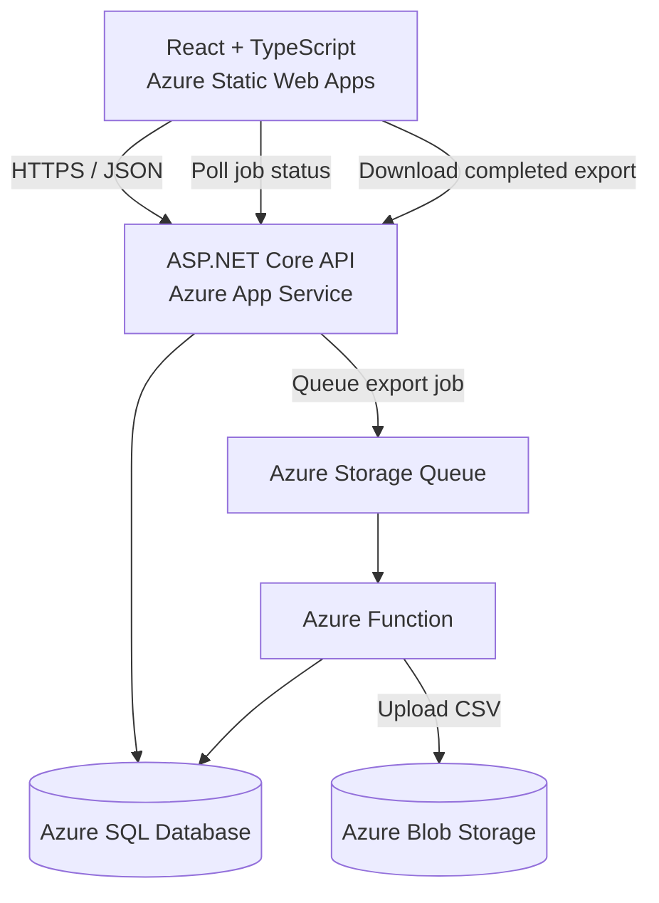

# Expense Tracker

A production-style, full-stack expense management application built with ASP.NET Core, React, TypeScript, and Microsoft Azure. It demonstrates secure authentication, clean architecture, cloud deployment, and asynchronous background processing in a practical end-to-end system.

> Portfolio project by [Megha Goel](https://github.com/MeghaGoel2409)

## Highlights

- Secure registration and login with ASP.NET Core Identity
- Short-lived JWT access tokens and rotating refresh tokens
- Refresh tokens stored in secure, HttpOnly cookies
- Expense and category management with validation
- Date, category, and period-based expense filtering
- Pagination, sorting, and currency-aware displays
- Dashboard summaries, recent expenses, category breakdowns, and monthly trends
- Asynchronous CSV export with job-status polling
- Azure Queue-triggered background processing and Blob Storage downloads
- Centralized exception handling, structured logging, and correlation IDs
- API versioning and OpenAPI documentation
- Automated deployments with GitHub Actions

## Technology Stack

### Backend

- C# and ASP.NET Core Web API
- Clean Architecture
- Entity Framework Core
- ASP.NET Core Identity
- JWT authentication and refresh-token rotation
- FluentValidation
- Serilog
- API Versioning
- Swagger / OpenAPI
- Result pattern and global exception middleware

### Frontend

- React and TypeScript
- Vite
- React Router
- TanStack Query
- Axios
- React Hook Form and Zod
- Tailwind CSS
- Sonner notifications

### Azure and DevOps

- Azure App Service
- Azure Static Web Apps
- Azure SQL Database
- Azure Functions (.NET isolated worker)
- Azure Storage Queues
- Azure Blob Storage
- GitHub Actions
- Azurite for local storage development

## Architecture



The backend follows Clean Architecture to keep business rules independent of infrastructure and delivery concerns:

```text
Domain
  ↑
Application
  ↑
Infrastructure
  ↑
WebApi
```

- **Domain** contains core entities and business concepts.
- **Application** contains use cases, interfaces, DTOs, validation, and application services.
- **Infrastructure** implements persistence, identity, storage, and external integrations.
- **WebApi** exposes versioned HTTP endpoints and configures the request pipeline.

## Authentication Flow

1. The user registers or signs in through the React client.
2. The API returns a short-lived JWT access token in the response body.
3. The refresh token is stored in a `Secure`, `HttpOnly`, `SameSite=None` cookie.
4. The client keeps the access token in memory and adds it to authenticated requests.
5. When the access token expires, the Axios refresh manager requests a new token.
6. Refresh tokens are rotated and can be revoked during logout.

This design keeps the refresh token unavailable to client-side JavaScript while avoiding long-lived access tokens in browser storage.

## Asynchronous Export Workflow

Large expense exports are processed outside the API request:

1. The client submits an export request with the selected filters.
2. The API creates an export job and adds a message to Azure Storage Queue.
3. An Azure Function processes the queued job.
4. The function generates the CSV file and uploads it to Blob Storage.
5. The React client polls the export-status endpoint with TanStack Query.
6. When processing completes, the user can download the generated file.

## Core Features

### Expenses

- Create, view, update, and delete expenses
- Filter by date range, category, and predefined periods
- Sort and paginate expense results
- Display values using the user's default currency
- Export filtered expenses asynchronously

### Categories

- Create, update, and delete custom categories
- Associate categories with expenses
- Reusable category selectors across forms and filters

### Dashboard

- Total spending summary
- Category-level spending breakdown
- Monthly spending trend
- Recent-expense list

### Reliability and Maintainability

- DTO-based API contracts
- Dependency injection
- FluentValidation request validation
- Global exception handling
- Structured Serilog logging
- Trace and correlation identifiers
- Feature flags for controlled functionality
- Consistent `Result` responses from application services

## Repository Structure

```text
expense-tracker/
├── expense-tracker-api/
│   ├── src/
│   │   ├── ExpenseTracker.Domain/
│   │   ├── ExpenseTracker.Application/
│   │   ├── ExpenseTracker.Infrastructure/
│   │   ├── ExpenseTracker.WebApi/
├── expense-tracker-functions/
│   ├── src/
│   │   └── ExpenseTracker.Functions/
├── expense-tracker-client/
│   ├── public/
│   └── src/
├── ExpenseTracker.slnx
├── .github/
│   └── workflows/
└── README.md
```

## Running Locally

### Prerequisites

- .NET SDK compatible with the API projects
- Node.js and npm
- SQLite or SQL Server, depending on the selected database provider
- Azurite for local Queue and Blob Storage emulation
- Visual Studio 2022, VS Code, or another preferred editor

### 1. Clone the repository

```bash
git clone https://github.com/MeghaGoel2409/expense-tracker.git
cd expense-tracker
```

### 2. Run the API

Configure development settings using .NET user secrets or a local settings file. Do not commit passwords, JWT secrets, storage connection strings, or database credentials.

```bash
cd expense-tracker-api
dotnet restore
dotnet run --project src/ExpenseTracker.WebApi
```

The development Swagger UI is available at the HTTPS address printed by the API when it starts.

### 3. Run the React client

Create `expense-tracker-client/.env.local`:

```env
VITE_API_BASE_URL=https://localhost:YOUR_API_PORT/api/v1
```

Then start the client:

```bash
cd expense-tracker-client
npm install
npm run dev
```

### 4. Run local Azure Storage

Start Azurite before testing queued exports. Configure the API and Functions projects to use local development storage, then start the isolated Azure Functions worker.

## Production Configuration

The deployed application requires configuration values for:

- Database provider and Azure SQL connection string
- JWT signing configuration
- Allowed CORS origins
- Azure Storage Queue and Blob Storage
- Feature flags
- Client `VITE_API_BASE_URL` build variable

Production secrets are stored in service configuration and GitHub secrets rather than committed to the repository.

## Deployment

- The React client is deployed to **Azure Static Web Apps**.
- The ASP.NET Core API is hosted on **Azure App Service**.
- Production data is stored in **Azure SQL Database**.
- Export jobs are delivered through **Azure Storage Queue**.
- A queue-triggered **Azure Function** creates export files.
- Completed exports are stored in **Azure Blob Storage**.
- GitHub Actions builds and deploys application changes.

## API Overview

The API uses URL-based versioning under `/api/v1` and includes endpoints for:

- Authentication: registration, login, refresh, logout, and current user
- Expenses: paged queries, details, creation, updates, deletion, and export
- Categories: listing and CRUD operations
- Dashboard: summaries, trends, category breakdowns, and recent expenses
- Export jobs: creation, status polling, and file download

## Security Notes

- Access tokens are stored in memory rather than local storage.
- Refresh tokens use secure HttpOnly cookies.
- Credentials are enabled only for explicitly allowed CORS origins.
- Password handling is delegated to ASP.NET Core Identity.
- Protected endpoints require JWT bearer authentication.
- Sensitive configuration is excluded from source control.

## Future Improvements

- Automated unit and integration test coverage
- Application health checks and monitoring dashboards
- Rate limiting for authentication and export endpoints
- Email verification and password-reset flows
- Additional export formats and scheduled reports

## Author

**Megha Goel**

- GitHub: [@MeghaGoel2409](https://github.com/MeghaGoel2409)
- Focus: Full-stack development with C#, ASP.NET Core, React, TypeScript, and Azure

## License

This repository is provided as a portfolio and learning project. Add a license file before allowing reuse or redistribution.
